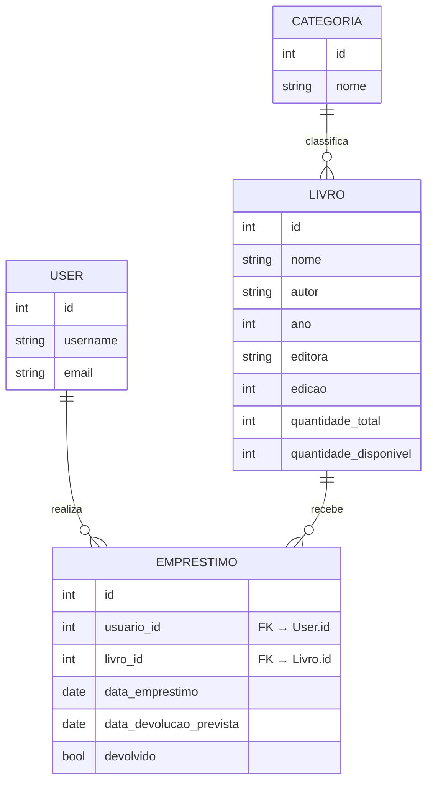

## Sistema de Gerenciamento de Biblioteca

Este projeto foi desenvolvido para a disciplina de **Programação Web**.

Trata-se de um sistema gerenciador de biblioteca, construído em Django.

### 🚀 Começando

Siga os passos abaixo para configurar e rodar o projeto localmente.

#### 1\. Clonar o Repositório

```bash
git clone https://github.com/JoaoMarcosLeal/sistema_de_biblioteca.git
cd sistema_de_biblioteca
```

#### 2\. Configurar o Ambiente Virtual

Crie um ambiente virtual para isolar as dependências:

```bash
python3 -m venv venv
```

#### 3\. Ativar o Ambiente Virtual

```bash
source venv/bin/activate
```

*(Se estiver no Windows, pode ser: `venv\Scripts\activate`)*

#### 4\. Instalar Dependências

Instale as dependências:

```bash
python3 -m pip install -r requirements.txt
```

#### 5\. Aplicar Migrações

Crie e aplique as migrações do banco de dados:

```bash
python3 manage.py makemigrations biblioteca
python3 manage.py migrate
```

#### 6\. Rodar o Servidor

Inicie o servidor de desenvolvimento:

```bash
python3 manage.py runserver
```

### 🖥️ Acesso ao Projeto

Após iniciar o servidor, você pode acessar:

  * **Página Inicial:** $\text{[http://127.0.0.1:8000/](http://127.0.0.1:8000/)}$
  * **Ambiente de Administração:** $\text{[http://127.0.0.1:8000/admin/](http://127.0.0.1:8000/admin/)}$

**(Nota: Você pode precisar criar um superusuário com `python3 manage.py createsuperuser` para acessar o admin.)**


